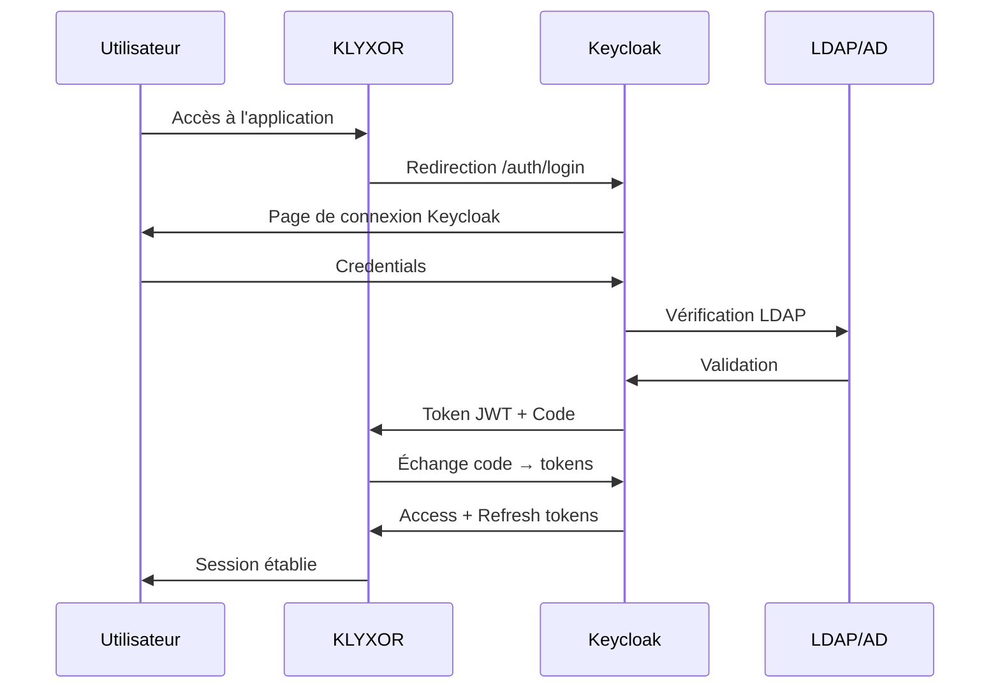

# Guide d'intégration Keycloak pour KLYXOR

## Vue d'ensemble

Cette documentation explique l'intégration de Keycloak comme solution IAM (Identity and Access Management) pour KLYXOR, remplaçant ou complétant l'authentification locale par une solution OAuth2/OIDC enterprise.

## Architecture de l'intégration

```
┌─────────────────┐     ┌──────────────┐     ┌───────────────┐
│                 │     │              │     │               │
│  Application    │────▶│   Keycloak   │────▶│   LDAP/AD     │
│    KLYXOR       │◀────│    Server    │◀────│    ENGIE      │
│                 │     │              │     │               │
└─────────────────┘     └──────────────┘     └───────────────┘
        │                      │                     │
        ▼                      ▼                     ▼
  [Frontend React]       [OAuth2/OIDC]        [Enterprise SSO]
```

## Configuration Keycloak

### 1. Création du Realm

```json
{
  "realm": "ENGIE",
  "enabled": true,
  "sslRequired": "external",
  "registrationAllowed": false,
  "loginWithEmailAllowed": true,
  "duplicateEmailsAllowed": false,
  "resetPasswordAllowed": true,
  "editUsernameAllowed": false,
  "bruteForceProtected": true
}
```

### 2. Configuration du Client

```json
{
  "clientId": "klyxor-client",
  "enabled": true,
  "protocol": "openid-connect",
  "publicClient": false,
  "standardFlowEnabled": true,
  "implicitFlowEnabled": false,
  "directAccessGrantsEnabled": true,
  "serviceAccountsEnabled": true,
  "authorizationServicesEnabled": false,
  "redirectUris": [
    "http://localhost:5000/api/auth/keycloak/callback",
    "https://klyxor.engie.com/api/auth/keycloak/callback"
  ],
  "webOrigins": [
    "http://localhost:5000",
    "https://klyxor.engie.com"
  ]
}
```

### 3. Mapping des rôles

| Rôle Keycloak | Rôle KLYXOR | Permissions |
|---------------|-------------|-------------|
| klyxor-admin | admin | Accès complet |
| klyxor-manager | manager | Gestion contrats |
| klyxor-validator | validator | Validation workflow |
| klyxor-finance | finance_manager | Gestion financière |
| klyxor-bu-manager | business_unit_manager | Gestion BU |
| klyxor-contract | contract_manager | Gestion contractuelle |

### 4. Configuration des claims

```json
{
  "name": "klyxor-claims",
  "protocol": "openid-connect",
  "protocolMapper": "oidc-usermodel-attribute-mapper",
  "config": {
    "user.attribute": "business_unit",
    "claim.name": "business_unit",
    "jsonType.label": "String",
    "id.token.claim": "true",
    "access.token.claim": "true"
  }
}
```

## Configuration KLYXOR

### 1. Variables d'environnement

```bash
# Copier le fichier d'exemple
cp .env.keycloak.example .env

# Configurer les variables
KEYCLOAK_ENABLED=true
KEYCLOAK_AUTH_URL=https://keycloak.engie.com/auth
KEYCLOAK_REALM=ENGIE
KEYCLOAK_CLIENT_ID=klyxor-client
KEYCLOAK_CLIENT_SECRET=your-secret-here
KEYCLOAK_REDIRECT_URI=https://klyxor.engie.com/api/auth/keycloak/callback
```

### 2. Migration des utilisateurs existants

```sql
-- Script de migration des utilisateurs vers Keycloak
UPDATE users 
SET 
  keycloak_id = email,  -- Utiliser l'email comme identifiant temporaire
  keycloak_sub = CONCAT('keycloak-', id),
  updated_at = NOW()
WHERE keycloak_id IS NULL;
```

### 3. Configuration Nginx (Production)

```nginx
server {
    server_name klyxor.engie.com;
    
    location / {
        proxy_pass http://localhost:5000;
        proxy_set_header Host $host;
        proxy_set_header X-Real-IP $remote_addr;
        proxy_set_header X-Forwarded-For $proxy_add_x_forwarded_for;
        proxy_set_header X-Forwarded-Proto $scheme;
    }
    
    # Endpoint spécifique pour Keycloak
    location /api/auth/keycloak/ {
        proxy_pass http://localhost:5000;
        proxy_buffer_size 128k;
        proxy_buffers 4 256k;
        proxy_busy_buffers_size 256k;
    }
}
```

## Flux d'authentification

### 1. Connexion utilisateur



### 2. Rafraîchissement de token

```typescript
// Service automatique de rafraîchissement
async function refreshUserToken(refreshToken: string) {
  const response = await fetch(`${KEYCLOAK_URL}/token`, {
    method: 'POST',
    headers: { 'Content-Type': 'application/x-www-form-urlencoded' },
    body: new URLSearchParams({
      grant_type: 'refresh_token',
      refresh_token: refreshToken,
      client_id: KEYCLOAK_CLIENT_ID,
      client_secret: KEYCLOAK_CLIENT_SECRET
    })
  });
  
  return response.json();
}
```

## API Endpoints

### Endpoints d'authentification

| Endpoint | Méthode | Description |
|----------|---------|-------------|
| `/api/auth/keycloak/login` | GET | Initie le flow OAuth2 |
| `/api/auth/keycloak/callback` | GET | Callback OAuth2 |
| `/api/auth/keycloak/logout` | POST | Déconnexion SSO |
| `/api/auth/keycloak/refresh` | POST | Rafraîchit le token |
| `/api/auth/keycloak/check` | GET | Vérifie la session |
| `/api/auth/keycloak/user` | GET | Info utilisateur |

### Exemples d'utilisation

```javascript
// Frontend - Vérifier l'authentification
async function checkAuth() {
  const response = await fetch('/api/auth/keycloak/check');
  const data = await response.json();
  
  if (!data.authenticated) {
    window.location.href = '/api/auth/keycloak/login';
  }
  
  return data.user;
}

// Frontend - Déconnexion
async function logout() {
  await fetch('/api/auth/keycloak/logout', { method: 'POST' });
  window.location.href = '/';
}

// Backend - Middleware protection
app.get('/api/protected', isAuthenticatedKeycloak, (req, res) => {
  res.json({ 
    message: 'Route protégée',
    user: req.user 
  });
});
```

## Sécurité

### 1. Configuration CORS

```typescript
const corsOptions = {
  origin: [
    'https://klyxor.engie.com',
    'https://keycloak.engie.com'
  ],
  credentials: true,
  optionsSuccessStatus: 200
};
```

### 2. Validation des tokens

```typescript
// Validation stricte des tokens JWT
const validateToken = async (token: string) => {
  try {
    // Vérifier la signature
    const decoded = jwt.verify(token, publicKey);
    
    // Vérifier l'expiration
    if (decoded.exp < Date.now() / 1000) {
      throw new Error('Token expiré');
    }
    
    // Vérifier l'issuer
    if (decoded.iss !== `${KEYCLOAK_URL}/realms/${KEYCLOAK_REALM}`) {
      throw new Error('Issuer invalide');
    }
    
    return decoded;
  } catch (error) {
    throw new Error('Token invalide');
  }
};
```

### 3. Gestion des sessions

```typescript
// Configuration des sessions sécurisées
app.use(session({
  secret: SESSION_SECRET,
  resave: false,
  saveUninitialized: false,
  cookie: {
    secure: true, // HTTPS uniquement
    httpOnly: true,
    maxAge: 24 * 60 * 60 * 1000, // 24 heures
    sameSite: 'strict'
  }
}));
```

## Monitoring et logs

### 1. Événements à surveiller

```typescript
// Logger les événements d'authentification
const logAuthEvent = (event: string, data: any) => {
  console.log(`[AUTH] ${event}`, {
    timestamp: new Date().toISOString(),
    userId: data.userId,
    ip: data.ip,
    userAgent: data.userAgent,
    success: data.success
  });
};
```

### 2. Métriques importantes

- Taux de connexion réussie/échouée
- Temps de réponse Keycloak
- Nombre de rafraîchissements de token
- Sessions actives
- Tentatives de connexion suspicieuses

## Troubleshooting

### Problèmes courants

#### 1. Erreur "Invalid redirect URI"
```bash
# Vérifier la configuration dans Keycloak
# Valid Redirect URIs doit inclure l'URL exacte
https://klyxor.engie.com/api/auth/keycloak/callback
```

#### 2. Erreur "Token expired"
```javascript
// Implémenter un retry avec refresh token
if (error.message === 'Token expired') {
  const newTokens = await refreshUserToken(refreshToken);
  // Réessayer la requête avec le nouveau token
}
```

#### 3. Erreur CORS
```javascript
// Vérifier les headers CORS
app.use((req, res, next) => {
  res.header('Access-Control-Allow-Credentials', 'true');
  res.header('Access-Control-Allow-Origin', req.headers.origin);
  next();
});
```

## Migration depuis l'authentification locale

### Phase 1 : Mode hybride
1. Activer Keycloak en parallèle
2. Migrer progressivement les utilisateurs
3. Maintenir la compatibilité

### Phase 2 : Migration complète
1. Désactiver l'authentification locale
2. Forcer l'utilisation de Keycloak
3. Nettoyer les anciennes sessions

### Script de migration

```bash
#!/bin/bash
# Migration des utilisateurs vers Keycloak

# 1. Export des utilisateurs existants
psql $DATABASE_URL -c "
  SELECT id, email, username, role, business_unit 
  FROM users 
  WHERE keycloak_id IS NULL
" > users_to_migrate.csv

# 2. Import dans Keycloak via API
while IFS=',' read -r id email username role bu; do
  curl -X POST "$KEYCLOAK_URL/admin/realms/ENGIE/users" \
    -H "Authorization: Bearer $ADMIN_TOKEN" \
    -H "Content-Type: application/json" \
    -d "{
      \"username\": \"$username\",
      \"email\": \"$email\",
      \"enabled\": true,
      \"attributes\": {
        \"business_unit\": [\"$bu\"],
        \"legacy_id\": [\"$id\"]
      }
    }"
done < users_to_migrate.csv

# 3. Mise à jour de la base de données
psql $DATABASE_URL -c "
  UPDATE users 
  SET keycloak_id = username,
      keycloak_sub = CONCAT('keycloak-', id)
  WHERE keycloak_id IS NULL
"
```

## Support et maintenance

### Contacts
- **Équipe Keycloak ENGIE** : keycloak-support@engie.com
- **Équipe KLYXOR** : klyxor-dev@engie.com
- **Sécurité** : security@engie.com

### Documentation
- [Keycloak Documentation](https://www.keycloak.org/documentation)
- [OAuth2 Specification](https://oauth.net/2/)
- [OpenID Connect](https://openid.net/connect/)

---

*Document créé le 03/09/2025*  
*Version 1.0.0*  
*Auteur : Équipe KLYXOR*